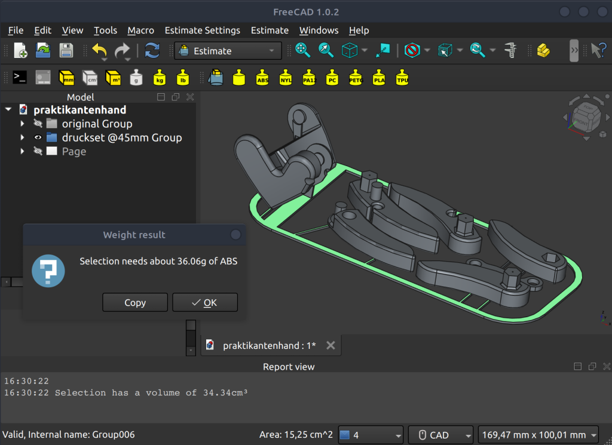

## Estimate Workbench 

A FreeCAD workbench to estimate material quantity

### Background
This frankenstein's monster of a workbench for FreeCAD has been somehow sewn together to work almost as expected.

You can display the volume or expected weight of a selected object at the push of a button. Both display with the decimal precision as set in FreeCAD's settings, but will always be rounded up to be on the safe side, as the output enables you to estimate or calculate the necessary amount of material for additive manufacturing (@100 % infill, ignoring support structures).

Some common 3d-printing materials are supported by default, but you can always select the weight calculation with a custom selected density in g/cm³.

**Note:** I am quite new to FreeCAD and creating workbenches but nonetheless excited.

The workbench has been tested with FreeCAD v0.19

### Installation 

#### Automatic Installation (recommended)

This workbench is available via the FreeCAD [Addon Manager](https://wiki.freecad.org/Std_AddonMgr).

#### Manual Installation

Expand for directions to manually install this workbench

This workbench can be installed manually by adding the whole folder into the personal FreeCAD folder

- for Linux `/home/user/.local/share/FreeCAD/Mod/`
- for Windows `%APPDATA%\FreeCAD\Mod\` or `C:\Users\username\Appdata\Roaming\FreeCAD\Mod\`
- for Windows as portable app `wherever_stored\FreeCADPortable\Data\FreeCADAppData\Mod`
- for macOS `~/Library/Preferences/FreeCAD/Mod/`

Occasionally rename from estimateWB-master to estimateWB if downloaded as zip from github

### Customize

If you want to change standard materials you can do so by editing the materials-dictionary within tools.py and add a respective named icon to the ressources-folder. The list of buttons will update itself. If you are unsatisfied with the default densities you are free to edit these within the dictionary as well. 

### Bug/Feedback

Please report bugs to the [issue queue](https://github.com/erroronline1/estimateWB/issues) and ping the [dedicated estimateWB FreeCAD forum thread]() to discuss said issue or feedback in general.   

## License

estimateWB is released under the LGPL3+ license. See [LICENSE](LICENSE).
